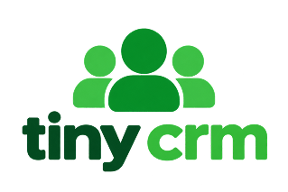

<div align="center">



### Your whole business. Organized.

A simple AI-powered CRM for contacts, deals, projects, tasks, and everything that happens between them.

</div>

---

## What this is

Tiny CRM is built for one person running several businesses at once — not for a sales
department with an admin. It is organised around four questions that every screen tries
to answer:

**What is happening? · Who is involved? · What needs my attention? · What should I do next?**

Where HubSpot offers a settings page, Tiny CRM picks a sensible default.

## Run it

```bash
npm install
npm run db:migrate     # creates the local SQLite database
npm run db:seed        # loads a realistic demo workspace
npm run dev
```

Open http://localhost:3000 and sign in:

| Account | Password | Plan |
|---|---|---|
| `owner@tinycrm.app` | `tinycrm` | Lifetime — the full demo dataset |
| `demo@tinycrm.app` | `tinycrm` | Free — for exercising plan limits |

The login screen also has an **Open the demo workspace** shortcut.

## What is in the demo

Four workspaces (Artifact Intelligence, Artifact Digital, DropQ, Personal Business
Development) holding 16 companies, 30 contacts, 13 projects, 22 deals, 6 RFP
opportunities, 34 tasks, 10 notes and a populated activity, email and calendar history.

It is written as a narrative rather than random noise: a provost who has gone quiet on a
budget decision, a pilot blocked on a security review, an RFP with a questions deadline
today. That is what makes the dashboard and Tiny AI worth looking at on first run.

## Keyboard

| Shortcut | Action |
|---|---|
| `⌘K` | Command bar — search everything, or ask Tiny AI |
| `⌘N` | Quick add |
| `⌘/` | Tiny AI panel |

## Tiny AI

Tiny AI has two modes, and the UI always says which one answered.

**Without an API key** it runs a built-in reasoning engine. This is not a stub: relationship
strength, deal momentum, win probability, project health, go/no-go recommendations,
duplicate detection and every hygiene check are *computed by the application* from your
data (`src/lib/scoring.ts`, `src/lib/ai/recommendations.ts`). They are exact, instant, free,
and every score explains itself — click any badge to see the factors that produced it.

**With an API key** the same computed facts are handed to a model, which writes them up in
prose and can answer open-ended questions.

```bash
# .env
ANTHROPIC_API_KEY="sk-ant-..."     # or OPENAI_API_KEY
ANTHROPIC_MODEL="claude-opus-5"
```

Two rules hold in both modes:

- **Tiny AI never writes to the CRM on its own.** Extracted records are proposed as a
  checklist and applied only when you approve them.
- **It cannot widen its own scope.** Context is assembled server-side, filtered to
  workspaces you already have access to, and capped before it is sent.

## Scripts

| Command | What it does |
|---|---|
| `npm run dev` | Development server |
| `npm run build` | Production build |
| `npm run typecheck` | TypeScript, no emit |
| `npm run lint` | ESLint |
| `npm run db:migrate` | Apply migrations |
| `npm run db:seed` | Reload the demo dataset |
| `npm run db:reset` | Drop, migrate, reseed |
| `npm run db:studio` | Prisma Studio |
| `npm run db:loadtest` | Build a 25k-record workspace and time every screen's queries |
| `npm run db:loadtest:clean` | Remove it |
| `npm run db:use-postgres` | Switch the datasource to PostgreSQL |

## Moving to PostgreSQL

The schema is written to run unchanged on both. It avoids every provider-specific
feature: no native enums (String columns validated in `src/lib/enums.ts`), no scalar lists
(real join tables), no JSON columns (JSON-in-String with typed helpers), and money as
integer minor units rather than `Decimal`.

```bash
npm run db:use-postgres          # flips the one provider line
# set DATABASE_URL="postgresql://..."
npx prisma migrate dev --name init-postgres
npm run db:seed
```

`src/lib/db.ts` selects the Prisma driver adapter from the shape of `DATABASE_URL`, so no
application code changes.

## Verifying it

```bash
npm run build && npm run typecheck && npm run lint
node e2e-verify.mjs               # 15 end-to-end browser checks (needs npm run dev)
npm run db:loadtest               # query timings at 25,000 contacts
```

`e2e-verify.mjs` drives a real browser through sign-in, the command bar, creating and
completing a task, dragging a deal between pipeline stages, the Tiny AI panel, workspace
switching, logging an activity, the analytics charts, AI capture, dark mode, mobile
layout and the marketing page.

## Documentation

- [`docs/ARCHITECTURE.md`](docs/ARCHITECTURE.md) — how it is built, what it is measured at,
  and what would have to change to go further.

## Stack

Next.js 16 (App Router, React 19) · TypeScript · Tailwind CSS v4 · Radix primitives ·
Prisma 7 · SQLite / PostgreSQL · NextAuth v5 · Recharts · dnd-kit · Anthropic / OpenAI
behind a provider abstraction.
